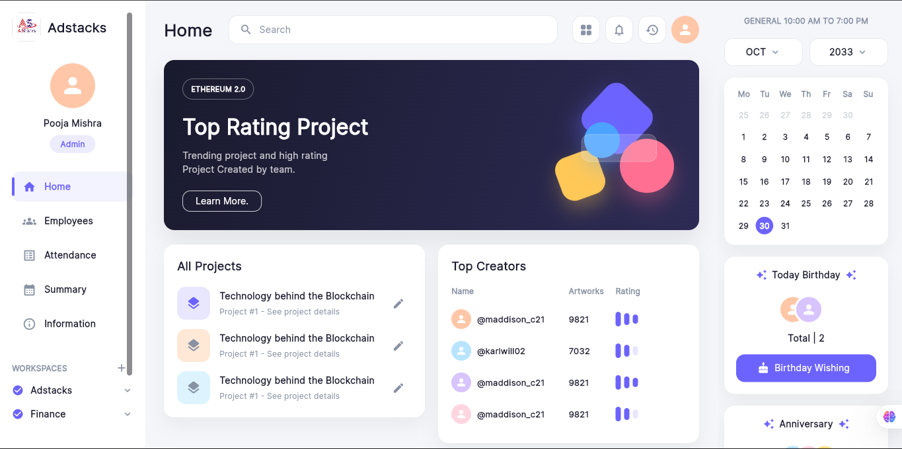
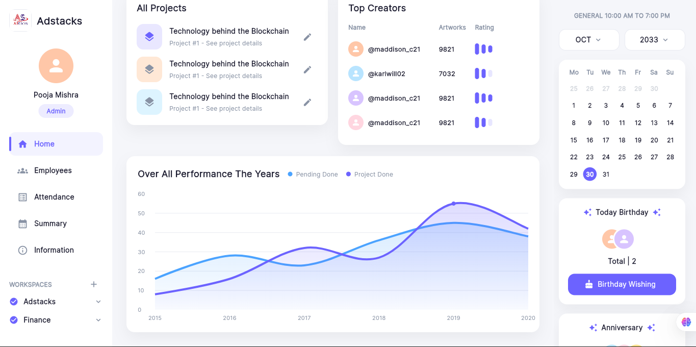
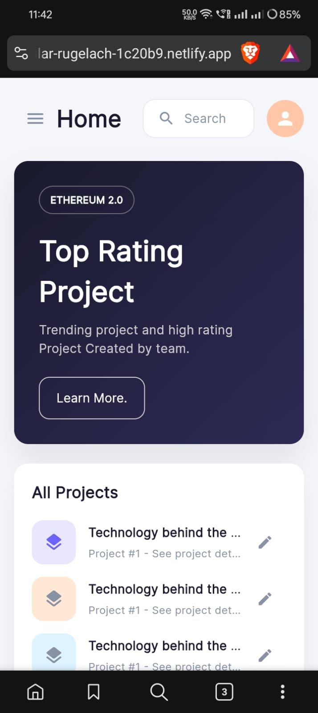
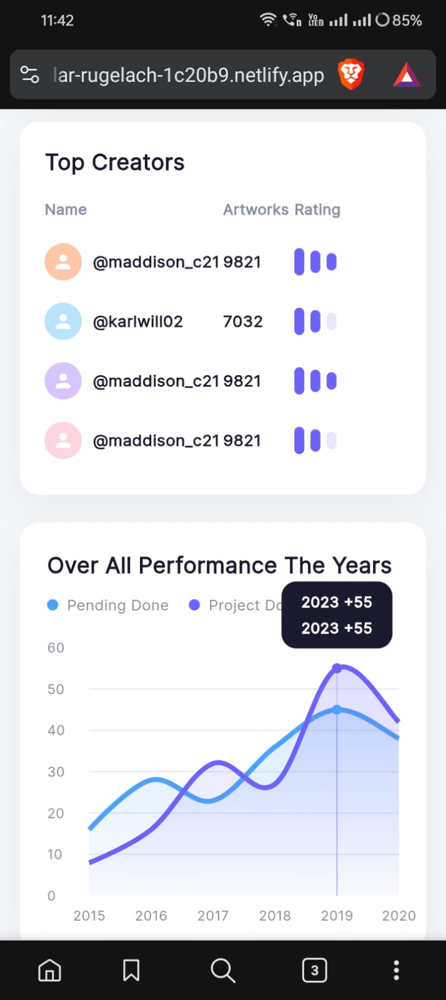
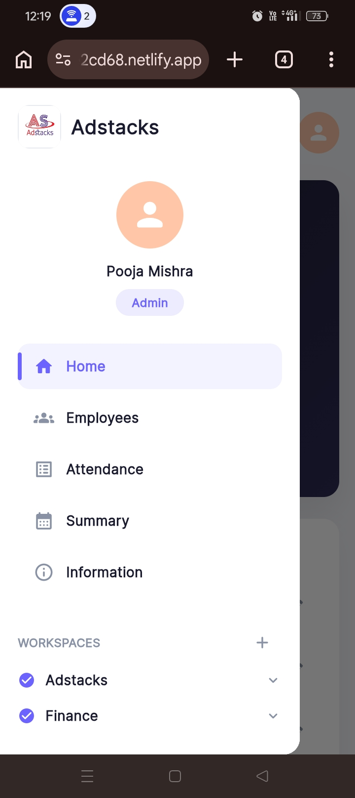

# 🏢 Adstacks Office Dashboard

A fully responsive **Flutter Web** office management dashboard built as part of the Adstacks Media Flutter Developer Internship assignment.


---

## 🌐 Live Demo

🔗 **[View Live Dashboard](https://singular-faun-e2cd68.netlify.app/)**

---

## 📸 Screenshots

### 🖥️ Web View





### 📱 Mobile View

<p float="left">
  
  
  
</p>

---

## ✨ Features

- 📊 **Performance Chart** — Animated line chart using `fl_chart` showing yearly performance trends
- 📁 **Projects List** — All projects with edit functionality
- 🏆 **Top Creators** — Leaderboard table with artwork ratings
- 📅 **Interactive Calendar** — Month navigation with date highlighting
- 🎂 **Birthday & Anniversary** — Employee celebration section
- 🔍 **Search Bar** — Global search UI
- 🔔 **Notifications** — Bell icon with indicator
- ⚙️ **Settings & Logout** — Sidebar navigation items
- 📱 **Fully Responsive** — Optimized for mobile, tablet, and web

---

## 🛠️ Tech Stack

| Technology | Usage |
|-----------|-------|
| Flutter 3.44.4 | Core framework |
| Dart | Programming language |
| fl_chart | Line chart visualization |
| responsive_framework | Responsive breakpoints |
| google_fonts | Typography |
| Netlify | Deployment |

---

## 📁 Project Structure

```
lib/
├── main.dart
├── screens/
│   └── dashboard_screen.dart
├── widgets/
│   ├── sidebar.dart
│   ├── top_navbar.dart
│   ├── hero_banner.dart
│   ├── projects_card.dart
│   ├── top_creators_card.dart
│   ├── performance_chart.dart
│   ├── right_panel.dart
│   ├── mini_calendar.dart
│   └── birthday_card.dart
└── theme/
    ├── app_colors.dart
    └── app_theme.dart
```

---

## 🚀 Getting Started

### Prerequisites

- Flutter SDK 3.44.4 or higher
- Dart SDK 3.x
- Chrome browser (for web)
- Git

### Installation

1. **Clone the repository**
```bash
git clone https://github.com/Ayush-2308/flutter-assignment.git
cd flutter-assignment
```

2. **Install dependencies**
```bash
flutter pub get
```

3. **Run on Chrome**
```bash
flutter run -d chrome
```

4. **Build for Web**
```bash
flutter build web
```

---

## 📦 Dependencies

```yaml
dependencies:
  flutter:
    sdk: flutter
  fl_chart: ^0.68.0
  responsive_framework: ^1.1.1
  google_fonts: ^6.1.0
```

---

## 📱 Responsive Breakpoints

| Screen | Breakpoint | Layout |
|--------|-----------|--------|
| Mobile | < 600px | Single column + Drawer |
| Tablet | 600px – 1100px | Sidebar + Content |
| Web/Desktop | > 1100px | Full 3-column layout |

---

## 🔥 Deployment (Netlify)

```bash
# Build web
flutter build web

# Deploy build/web folder on Netlify
# Go to netlify.com → Drop build/web folder → Done!
```

---

## 📋 Assignment Requirements

| Requirement | Status |
|------------|--------|
| Responsive Design (Mobile/Tablet/Web) | ✅ Done |
| Dashboard UI matching provided design | ✅ Done |
| Performance Chart (fl_chart) | ✅ Done |
| Netlify Deployment | ✅ Done |
| Navigation & CTAs | ✅ Done |

---

## 👨‍💻 Developer

**Ayush**  
MCA Student — Amity University, Noida  
Flutter & Android Developer

📧 Submitted to: hr@adstacks.in

---

## 📄 License

This project was created as part of a Flutter internship assignment for **Adstacks Media**.
